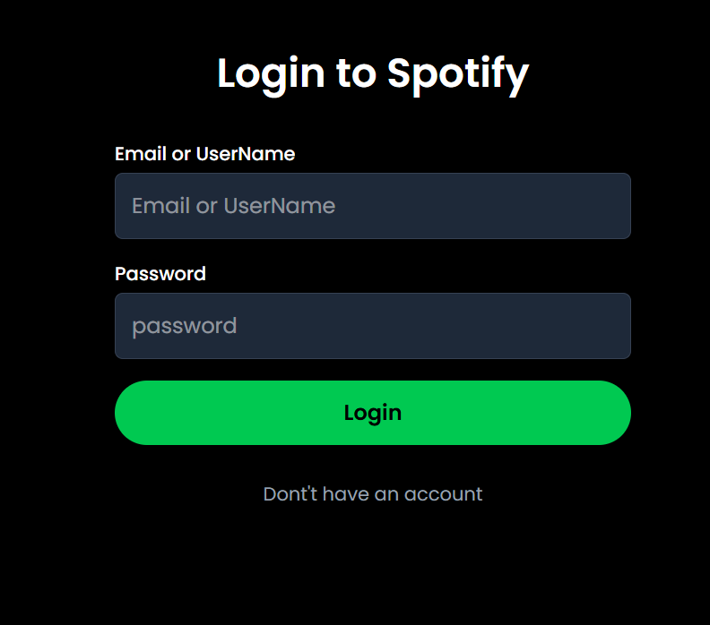

# Spotify Clone - Microservices Architecture

This project is a fully functional Spotify Clone built using a microservices architecture. It is designed to provide a seamless music streaming experience with features like user authentication, playlist management, and song/album browsing. The project is deployed on modern cloud platforms with auto-deployment enabled for both frontend and backend services.

## Project Overview

### Frontend
- **Stack**: React, TypeScript, TailwindCSS
- **Build Tool**: Vite
- **Deployment**: Vercel
- **Features**:
  - User authentication (login/register)
  - Browse songs and albums
  - Manage playlists
  - Admin dashboard for adding songs and albums

### Backend
- **Microservices**:
  1. **User Service**: Handles user authentication and playlist management.
  2. **Admin Service**: Allows admins to add songs and albums.
  3. **Song Service**: Provides song and album data to the frontend.
- **Stack**: Node.js, Express, TypeScript
- **Databases**:
  - **MongoDB**: Used for user data and playlist management.
  - **Neon PostgreSQL**: Used for storing song and album data.
- **Caching**: Redis is used to cache frequently accessed data, improving performance and reducing database load.
- **Deployment**: Railway

### Deployment
- **Frontend**: Deployed on Vercel for fast and reliable hosting.
- **Backend**: Each microservice is independently deployed on Railway.
- **Auto-Deployment**: The project is configured for auto-deployment. Any commit and push to the GitHub repository triggers deployment for both frontend and backend services.

## Architecture Diagram


## Redis for Performance
Redis is used to cache frequently accessed data, such as song and album details. This reduces the load on the Neon PostgreSQL database and improves response times for the user.

### Example:
- When a user requests a list of songs, the Song Service first checks Redis for cached data.
- If the data is available in Redis, it is returned immediately.
- If not, the data is fetched from the database, cached in Redis, and then returned to the user.

## How to Run Locally

### Prerequisites
- Node.js and npm installed
- MongoDB and PostgreSQL databases set up
- Redis server running

### Steps
1. Clone the repository:
   ```bash
   git clone https://github.com/nik8839/Spotify_Clone.git
   cd spotify-clone
   ```

2. Install dependencies for each service:
   ```bash
   cd frontend
   npm install
   cd ../user_service
   npm install
   cd ../admin_service
   npm install
   cd ../song_service
   npm install
   ```

3. Set up environment variables:
   - Create `.env` files in each service directory with the required variables (e.g., database URLs, JWT secrets).

4. Start the services:
   ```bash
   # Start frontend
   cd frontend
   npm run dev

   # Start user service
   cd ../user_service
   npm run dev

   # Start admin service
   cd ../admin_service
   npm run dev

   # Start song service
   cd ../song_service
   npm run dev
   ```

5. Access the application:
   - Frontend: `http://localhost:3000`
   - User Service: `http://localhost:5000`
   - Admin Service: `http://localhost:5001`
   - Song Service: `http://localhost:5002`

## Images to Add
- **Architecture Diagram**:


- **Frontend UI**: 



## Conclusion
This Spotify Clone demonstrates the power of microservices architecture, modern frontend frameworks, and cloud deployment. It is scalable, efficient, and easy to maintain, making it a great example of a production-ready application.